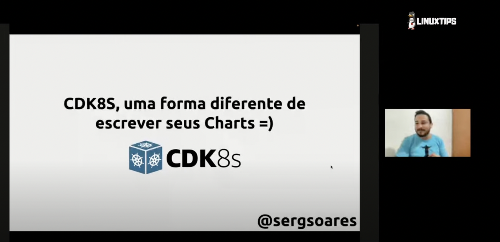

## CDK8S Platform Engineer

Código utilizado na apresentação "CDK8S, uma forma diferente de escrever seus Charts" do Platform Engineer 2023

## Referências

- https://kind.sigs.k8s.io/docs/user/ingress/
- https://github.com/joshdavidson/firework8s/tree/main/cdk8s-examples
- https://www.convertsimple.com/convert-yaml-to-javascript-object/
- https://github.com/cdk8s-team/cdk8s-examples/blob/main/typescript/cdk8s-plus-pod-info/index.ts
- https://aws.amazon.com/pt/blogs/containers/introducing-cdk-for-kubernetes/
- https://www.cncf.io/online-programs/end-yaml-engineering-with-cdk8s/
- https://aws.amazon.com/pt/blogs/containers/introducing-cdk-for-kubernetes/
- https://developer.hashicorp.com/terraform/tutorials/cdktf/cdktf-build
- https://github.com/aws/aws-cdk
- https://github.com/aws/constructs
- https://shipit.dev/posts/integrating-cdk8s-with-argocd.html
- https://www.stridenyc.com/blog/declarative-infrastructure-for-beginners
- https://dev.to/vumdao/cdk8s-example-2glk
- https://github.com/cdk8s-team/cdk8s-plus
- https://github.com/cdk8s-team/cdk8s-examples
- https://github.com/cdk8s-team/cdk8s-examples/blob/main/typescript/cdk8s-plus-pod-info/index.ts
- https://github.com/cdk8s-team/cdk8s-examples/blob/main/typescript/cdk8s-plus-web-cache-db/index.ts
- https://aws.amazon.com/pt/blogs/containers/introducing-cdk-for-kubernetes/
- https://www.cncf.io/online-programs/end-yaml-engineering-with-cdk8s/
- https://cdk8s.io/
- https://docs.aws.amazon.com/cdk/v2/guide/getting_started.html
- https://github.com/cloudnative-pg/cloudnative-pg/tree/main/docs/src/samples